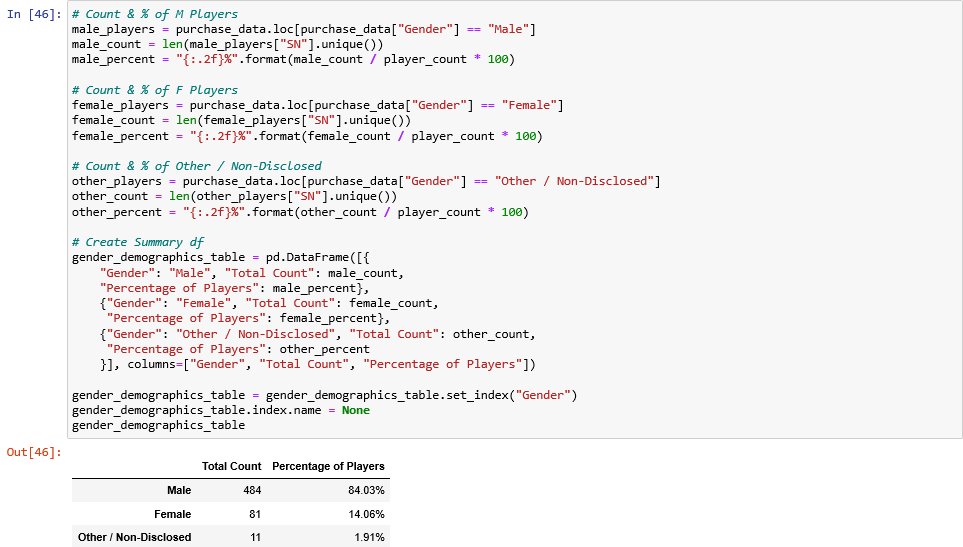

# pandas-challenge - Heroes of Pymoli

## Table of Content ##
*Overview,*
*Infographic,*
*Heroes of Pymoli Report,*
*Three Observable Trends,*
*Technologies used.*

## Overview ##
*Heroes of Pymoli*
Congratulations! After a lot of hard work in the data munging mines, you've landed a job as Lead Analyst for an independent gaming company. You've been assigned the task of analysing the data for their most recent fantasy game *Heroes of Pymoli*.
Like many others in its genre, the game is free-to-play, but players are encouraged to purchase optional items that enhance their playing experience. As a first task, the company would like you to generate a report that breaks down the game's purchasing data into meaningful insights.

## Inforgraphic ##

## Heroes of Pymoli Report ##

# Player Count #
* Total number of players:

# Purchasing Analysis #
* Number of unique items
* Average purchase price
* Total number of purchases
* Total revenue

# Gender Demographics #
* Percentage and count of male players
* Percentage and count of female players
* Percentage and count of other / non-disclosed

# Purchasing Analysis (Gender) #
* The below each broken by gender
  * Purchase count
  * Average purchase price
  * Total purchase value
  * Average purchase total per person by gender

# Age Demographics #
* Total count
* Percentage of players

# Purchasing Analysis (Age) #
* The below each broken into bins of 4 years
* Purchase count
* Average purchase price
* Total purchase value
* Average purchase total per person by age group

# Top Spenderss #
* Identify the top 5 spenders in the game by total purchase value, then list (in a table):
  * SN
  * Purchase count
  * Average purchase price
  * Total purchase value

# Most Popular Items #
* Identify the 5 most popular items by purchase count, then list (in a table):
  * Item ID
  * Item Name
  * Purchase count
  * Item price
  * Total purchase value

# Most Profitable Items #
* Identify the 5 most profitable items by purchase count, then list (in a table):
  * Item ID
  * Item Name
  * Purchase count
  * Item price
  * Total purchase value

## Three Observable Trends ##

When we analyze the data on the fantasy game “ Heroes of Pymoli”, we can observe three trends. We can analyze the data on 576 players.

Males are the ones who play the most with a percentage of 86% versus 14% for the females. However, female players spend 6% in average more than the male.

Also 3/4 of the players are between 15 and 29 year-olds. The biggest number of players are the 20-24 year-olds. Together, they represent 45% of the population or 258 players. If they are the most present in the population, they are, however, not the one who spend the most money. The 35-39 year-olds are the category who has the highest purchasing power: With $3.60 spent in average, this category of age make almost 20% difference compare to the 15-29 year-olds who represent 77% of the purchasers. The top 5 spenders spent an average of $3.45 per purchase with a total average purchase of $13.32.

Last but not least, three of the four most popular items are also the most profitable. The number one item in each category goes to “Oathbreaker, Last Hope of the Breaking Storm”. 12 of them have been sold for a total value of $50.76. Nevertheless, if we divide the total purchase value by the purchase count, the number one item is the “Fiery Glass Crusader” with a ratio of $4.90 per game and the last one is “Oathbreaker, Last Hope of the Breaking Storm” with a ratio of $4.23. Then we can explain its highest quantity sold because it is the least expensive.

## Technologies used ##
* Pandas Library
* Jupyter Notebook
* Adobe Illustrator
* .cvs files
  
## Authors ##
Sylvain David - Data Analytics Bootcamp - Vanderbilt University - 2020
Illustrations by Sylvain David - All Rights Reserved - 2020